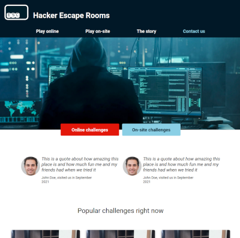

## Repo: esc-hacker-escape-rooms
# ESC - Hacker Escape Rooms  
### Min publicerade sida når du här: <a href="https://anteman-swe.github.io/esc-hacker-escape-rooms/dist/">https://anteman-swe.github.io/esc-hacker-escape-rooms/dist/</a>

---
## Projekt i Lernia YH utbildning SJPI25 A2 + A3 med flera del-inlämningar  

Inlämningsuppgift 3 fil(er)
Med denna uppgift inleds utbildningens andra projekt, som kommer att fortgå under nio veckor och bestå av flera delinlämningar.

Projektet bygger på en brief från ett fiktivt företag som ni kan läsa här: https://docs.google.com/document/d/1f-rogD-2GgbH3XdCCkNp3vFKK0Gizj3SoMAAcHSdN1k

__Uppgiften__  
Denna uppgift är den första delinlämningen i projektet, och utgör examinering av kursen “Webbutveckling – HTML & CSS”.

Uppgiften är att implementera responsiv layout och utseende på startsidan, på ett sätt som ser exakt ut som specificeras av UX-designer / formgivare.

Uppgiften innefattar även en skriftlig inlämning samt muntlig avstämning där studenten ska motivera val av verktyg och hur man valt att strukturera sin kod.

__Moment__  
1. Producera en responsiv webbsida enligt designspecifikation välj själv tekniker (exempelvis SASS, Tailwind, Bootstrap eller bara vanlig CSS)  
2. Motivera skriftligt val av tekniker och verktyg  
3. Beskriv skriftligt hur du strukturerat din kod  
4. Delta i muntlig _gruppdiskussion_ (bokas onsdag 22/10 eller torsdag 23/10) om tekniker, verktyg och struktur  

Moment 1-3 sker individuellt.

__Material__  
Exakt designspecifikation  
Se bifogade bilder  
Se även Figma (registrera konto för detaljer, valfritt):  
https://www.figma.com/file/0CWDexKE9i3I3yZFiFeDCE  

__Inlämning__  
Uppgiften lämnas in genom att publicera sidan med GitHub Pages och följande skickas in via __ItsLearning__:  
__Länk__ till den publika sidan (Github Pages)  
__Länk__ till repot där källkoden finns  
__Text__ där man motiverar val av tekniker och hur man strukturerat sin kod, minst ca 200 ord  

__Betygskriterier__  
_Betyg Godkänd_  
_Enligt kursplanen_: För att få betyget Godkänt (G) ska den studerande ha genomfört kursen och nått alla kursens läranderesultat.

Det betyder för denna uppgift:

- __Källkod redovisad__ via _GitHub_  
- __Sidan publicerad__ via _Github Pages_  
- __Skriftlig inlämning__ genomförd  
- __Strukturerad HTML och CSS (eller motsvarande)__  
- God likhet avseende färger, typsnitt, avstånd m.m. mellan inlämnad produkt och designspecifikation  
- __Deltagande__ i muntlig gruppdiskussion om uppgiften  

_Betyg Väl Godkänd_  
_Enligt kursplanen:_ För att få betyget Väl godkänt (VG) ska den studerande med hög kvalitet genomfört kursen och nått alla kursens läranderesultat.

_Det betyder för denna uppgift, utöver kraven för godkänt:_

Väl strukturerad, semantiskt korrekt HTML och CSS  
Mycket god likhet avseende färger, typsnitt, avstånd m.m. mellan inlämnad produkt och designspecifikation  
Väl underbyggda val av teknik och struktur  

## Challenges-sidan
- lag till 'challenges.html' med egen layout för our challenges. 
- Återanvänt header, footer, grundstyling för main.scss
- Lagt till grid-layout för korts, med: 
- kolumn på mobil, 2 kolumner på tablet, 3 kolumner på desktop. 
- har skapat två exempel kort för data-type = online och data-type = on-site som kan användas som mall när API:t kopplas
- lagt till filter Challenges knapp
- tagit bort hacker bilden så den matchar mallen från whimsical. 
Projektet går ut på att skapa en hemsida för ett fiktivt företag som låter grupper utföra problem-lösning i ett flertal utmaningar, "Rooms"  
  
  

